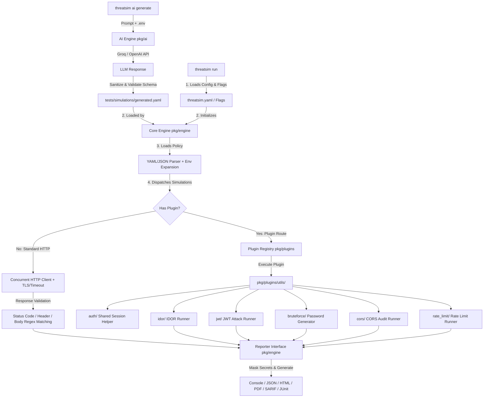

# ThreatSim

[](https://golang.org)
[](https://opensource.org/licenses/MIT)
[](https://github.com/suryatk2007/threatsim)
[](./docs/internals.md)

ThreatSim is a high-performance **Security Behavior Validation Engine** that verifies whether an application's security controls behave as intended. Instead of searching for known vulnerabilities, it executes declarative policy-as-code simulations and stateful security attack plugins to validate authentication, authorization, JWT verification, IDOR protection, CORS enforcement, rate limiting, and other security boundaries. Built with a modular plugin architecture, concurrent execution engine, schema validation, and multi-format reporting, ThreatSim integrates seamlessly into CI/CD pipelines to prevent security regressions before deployment.

---

## 🚀 Key Features

* **Policy-as-Code Validation**: Define security behaviors using clean, human-readable YAML or JSON policies. Supports environment variable expansion (`${TEST_API_KEY}`) to avoid hardcoding secrets.
* **Parallel Concurrency Engine**: Runs test simulations concurrently in parallel goroutines for blazing-fast execution (< 50ms test suites).
* **Stateful Attack Plugins**: Advanced, multi-step security logic encapsulated into native Go plugins:
  * **IDOR Validation (`idor`)**: Authenticates as multiple tenants in parallel, extracts tokens and resource IDs via dot-notation JSON paths (`data.user.id`), and validates cross-tenant isolation boundaries.
  * **JWT Signature Forgery (`jwt_forge`)**: Tests JWT validation controls across 3 attack modes (`signature_tamper`, `alg_none`, and `weak_secret` HMAC re-signing).
  * **Brute-Force Rate Limiting (`bruteforce`)**: Evaluates rate-limiting and soft-lockout controls across concurrent worker pools with custom wordlist support.
  * **CORS Audit (`cors_audit`)**: Audits origin reflection (`https://attacker.com`, `null`), wildcard `*` with credentials enabled, and preflight CORS header enforcement.
  * **Endpoint Rate Limiting (`rate_limit`)**: Tests generic API endpoint throttling for public endpoints (`/api/search`, `/checkout`, `/contact`) with configurable concurrency bursts.
* **Flexible HTTP Controls**: Custom per-request timeouts (`timeout: "5s"`) and `--insecure` flags to test internal or staging environments with self-signed SSL/TLS certificates.
* **CI/CD Multi-Format Reporting**: Generates machine-readable and audit-ready reports (`console`, `json`, `html`, `pdf`) with automatic secret masking to prevent credential leaks in build logs.

---

## 📐 Architecture Overview




---

## 📦 Quick Start

### 1. Installation

Build the single binary executable:

```bash
git clone https://github.com/suryatk2007/threatsim.git
cd threatsim
go build -o threatsim .
```

### 2. Configuration (`threatsim.yaml`)

Create a `threatsim.yaml` file in your root workspace directory:

```yaml
target_url: "https://api.example.com"
file: "tests/simulations/parallel_test.yaml"
timeout: "30s"      # Default timeout for HTTP requests (e.g. 5s, 15s, 1m)
insecure: false     # Set to true to skip TLS/SSL verification for staging/self-signed certs
```

### 3. Running Simulations

Execute validations using the CLI:

```bash
# Run default configuration defined in threatsim.yaml
./threatsim run

# Run against a specific target and simulation policy file
./threatsim run -t https://api.staging.local -f tests/simulations/idor_test.yaml

# Run against a staging server with self-signed SSL certificate and 30s timeout
./threatsim run -t https://staging.internal --insecure --timeout 30s -f tests/simulations/timeout_test.yaml

# Generate machine-readable JSON or visual HTML/PDF reports
./threatsim run --output json --out-file reports/audit_result.json
./threatsim run --output html --out-file reports/dashboard.html
./threatsim run --output pdf --out-file reports/security_audit.pdf
```

### 4. AI-Powered Policy Generation (`threatsim ai generate`)

Convert natural language security requirements into schema-validated ThreatSim YAML policy files using OpenAI-compatible AI providers (Groq, OpenAI, Ollama):

1. **Configure Environment Secrets (`.env`)**:
   ```bash
   cp .env.example .env
   # Edit .env and set your Groq API key:
   THREATSIM_AI_API_KEY=gsk_your_groq_api_key_here
   ```

2. **Generate Simulations from Natural Language**:
   ```bash
   # Interactive mode (multiline prompt, press Ctrl+D when finished):
   ./threatsim ai generate

   # Inline prompt flag mode:
   ./threatsim ai generate -p "Users should only access their own profile. Login should lockout after 5 failures."

   # Scriptable file mode:
   ./threatsim ai generate -i requirements.txt -o tests/simulations/generated.yaml
   ```

---


## 📝 Writing Validation Policies

Test cases are declared in YAML files under [`tests/simulations/`](file:///home/suryatk/ThreatSIM/tests/simulations/).

### Example 1: Standard HTTP & Custom Request Timeout

Validate that unauthorized requests return `401 Unauthorized` and forbidden paths return `403 Forbidden`:

```yaml
version: "1.0"
simulations:
  - name: "Verify unauthenticated access returns 401"
    request:
      method: "GET"
      path: "/api/secure-data"
      timeout: "5s" # Per-request timeout override
    expected:
      status_code: 401

  - name: "Verify standard users cannot access admin delete"
    request:
      method: "POST"
      path: "/api/admin/delete"
      headers:
        Authorization: "Bearer user-token"
    expected:
      status_code: 403
```

### Example 2: Regex & Environment Variable Expansion

Use system environment variables safely and assert strict schema matching using `body_regex`:

```yaml
version: "1.0"
simulations:
  - name: "Verify API Key is enforced and returns correct JSON error"
    request:
      method: "GET"
      path: "/api/billing"
      headers:
        Authorization: "Bearer ${TEST_API_KEY}"
    expected:
      status_code: 403
      body_regex: '"error_code":\s*"AUTH_\d+"'
```

### Example 3: Cross-Tenant IDOR Plugin (`idor`)

Validate that User B cannot access User A's private resource across path URLs or JSON request bodies using custom HTTP methods (`GET`, `POST`, `PUT`, `DELETE`, `PATCH`):

```yaml
version: "1.0"
simulations:
  - name: "Cross-Tenant GET Path IDOR Validation"
    plugin: "idor"
    config:
      target_method: "GET"
      auth_path: "/auth/login"
      user_a_payload: '{"username":"admin", "password":"secret123"}'
      user_b_payload: '{"username":"guest", "password":"password123"}'
      token_json_path: "data.token"
      id_json_path: "data.user.id"
      target_path: "/api/users/{id}/private-data"
      expected_status_code: 403

  - name: "Cross-Tenant PUT Body IDOR Validation"
    plugin: "idor"
    config:
      target_method: "PUT"
      auth_path: "/auth/login"
      user_a_payload: '{"username":"admin", "password":"secret123"}'
      user_b_payload: '{"username":"guest", "password":"password123"}'
      token_json_path: "data.token"
      id_json_path: "data.user.id"
      target_path: "/api/users/update"
      target_payload: '{"user_id":"{id}","role":"hacked"}'
      expected_status_code: 403
```

#### Example 4: Plugin Guardrails & Custom Wordlists (`bruteforce`)
Plugins include built-in safety guardrails (max 1000 requests) and support custom wordlists (`wordlist_path`) as well as custom JSON payload key mappings (`username_field`, `password_field`).

```yaml
version: "1.0"
simulations:
  - name: "Admin Login Bruteforce Test"
    plugin: "bruteforce"
    config:
      path: "/login"
      username: "admin@example.com"
      username_field: "user_email" # Custom payload field key (Defaults to "username")
      password_field: "user_pass"  # Custom payload field key (Defaults to "password")
      wordlist_path: "wordlists/custom.txt" # Optional path to custom password wordlist
      num_requests: 100
      expected_status_code: 429
      expected_body_contains: "locked"
```

### Example 5: JWT Signature Forgery Plugin (`jwt_forge`)

Validate that your backend strictly verifies cryptographic signatures across 3 attack modes (`signature_tamper`, `alg_none`, `weak_secret`):

```yaml
version: "1.0"
simulations:
  - name: "JWT Signature Tampering Test"
    plugin: "jwt_forge"
    config:
      attack_mode: "signature_tamper" # Alter payload claims, keep old signature
      auth_path: "/auth/login"
      auth_payload: '{"username":"guest", "password":"password123"}'
      token_json_path: "data.token"
      target_path: "/api/admin/secrets"
      forge_claims:
        role: "admin"
      expected_status_code: 401

  - name: "JWT Alg None Header Bypass Test"
    plugin: "jwt_forge"
    config:
      attack_mode: "alg_none" # Header "alg": "none", strip signature
      auth_path: "/auth/login"
      auth_payload: '{"username":"guest", "password":"password123"}'
      token_json_path: "data.token"
      target_path: "/api/admin/secrets"
      forge_claims:
        role: "admin"
      expected_status_code: 401

  - name: "JWT Weak Secret Re-Signing Test"
    plugin: "jwt_forge"
    config:
      attack_mode: "weak_secret" # Re-sign payload using weak HMAC secrets
      weak_secret: "secret"
      auth_path: "/auth/login"
      auth_payload: '{"username":"guest", "password":"password123"}'
      token_json_path: "data.token"
      target_path: "/api/admin/secrets"
      forge_claims:
        role: "admin"
      expected_status_code: 401
```

### Example 6: CORS Audit Plugin (`cors_audit`)

Validate that your backend strictly enforces CORS origin boundaries and rejects untrusted origin reflections (`https://attacker.com`, `null`, wildcard `*` with credentials):

```yaml
version: "1.0"
simulations:
  - name: "CORS Untrusted Origin Reflection Audit"
    plugin: "cors_audit"
    config:
      path: "/api/users/100/private-data"
      custom_origin: "https://attacker.com"
      test_null_origin: true
      expected_allow_credentials: false
```

### Example 7: Endpoint Rate Limit Plugin (`rate_limit`)

Test API endpoint throttling on public endpoints (`/api/search`, `/checkout`, `/contact`) using configurable concurrency bursts:

```yaml
version: "1.0"
simulations:
  - name: "Public Endpoint Throttling Rate Limit Test"
    plugin: "rate_limit"
    config:
      path: "/login"
      method: "POST"
      num_requests: 30
      concurrency: 5
      expected_status_code: 429
      expected_body_contains: "locked"
```

---

## 📜 Schema Definitions

ThreatSim provides authoritative schema definitions for both standard HTTP simulations and plugins:

* 📄 **[schemas/simulation.yaml](file:///home/suryatk/ThreatSIM/schemas/simulation.yaml)**: Standard HTTP & Plugin Simulation Schema
* 📄 **[schemas/plugins/idor.yaml](file:///home/suryatk/ThreatSIM/schemas/plugins/idor.yaml)**: IDOR Plugin Configuration Schema
* 📄 **[schemas/plugins/jwt_forge.yaml](file:///home/suryatk/ThreatSIM/schemas/plugins/jwt_forge.yaml)**: JWT Forge Plugin Configuration Schema
* 📄 **[schemas/plugins/bruteforce.yaml](file:///home/suryatk/ThreatSIM/schemas/plugins/bruteforce.yaml)**: Bruteforce Plugin Configuration Schema
* 📄 **[schemas/plugins/cors_audit.yaml](file:///home/suryatk/ThreatSIM/schemas/plugins/cors_audit.yaml)**: CORS Audit Plugin Configuration Schema
* 📄 **[schemas/plugins/rate_limit.yaml](file:///home/suryatk/ThreatSIM/schemas/plugins/rate_limit.yaml)**: Rate Limit Plugin Configuration Schema

---

## 🛠️ CLI Command & Flag Reference

### `threatsim run` Flags

| Flag | Short | Default | Description |
| :--- | :---: | :---: | :--- |
| `--target-url` | `-t` | `""` | Base URL of the target application (e.g. `http://localhost:8080`). |
| `--file` | `-f` | `""` | Path to the YAML or JSON simulation policy file. |
| `--timeout` | | `"15s"` | Default HTTP request timeout (e.g. `5s`, `15s`, `1m`). |
| `--insecure` | | `false` | Skip SSL/TLS certificate verification for staging/self-signed certs. |
| `--output` | `-o` | `"console"` | Report output format (`console`, `json`, `html`, `pdf`, `sarif`, `junit`). |
| `--out-file` | | `""` | Write report to file path instead of `stdout`. |

### `threatsim ai generate` Flags

| Flag | Short | Default | Description |
| :--- | :---: | :---: | :--- |
| `--prompt` | `-p` | `""` | Direct natural language security requirement text prompt. |
| `--input` | `-i` | `""` | File path containing security requirement description text. |
| `--out-file` | `-o` | `"tests/simulations/generated.yaml"` | Target output path for generated ThreatSim YAML file. |

### `threatsim plugins`

Lists all installed ThreatSim validation plugins, descriptions, and YAML schema paths.

---


## 🧪 Testing with Mock Servers

ThreatSim includes two built-in mock servers for validation:

1. **Vulnerable Mock Server (Port 8080)**:
   ```bash
   go run examples/mockserver/main.go
   # Run simulations - ThreatSim will FAIL them (proving it caught the vulnerabilities):
   ./threatsim run -t http://localhost:8080 -f tests/simulations/jwt_test.yaml
   ```

2. **Secure Mock Server (Port 8081)**:
   ```bash
   go run examples/secure_mockserver/main.go
   # Run simulations - ThreatSim will PASS them (proving security controls work):
   ./threatsim run -t http://localhost:8081 -f tests/simulations/jwt_test.yaml
   ```

---

## 📖 Deep Dive Documentation

For detailed architectural breakdown, design decisions, Go unit test suite details, and instructions for building custom Go plugins, read our **[Internals Documentation](./docs/internals.md)**.