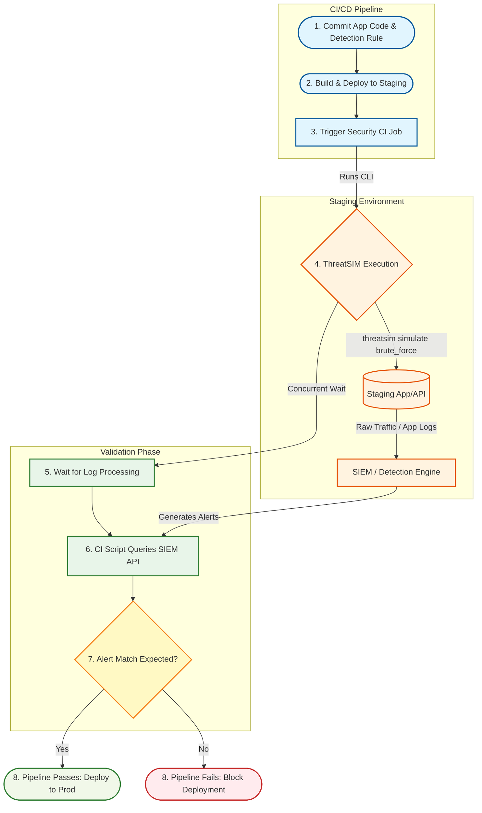

# ThreatSIM CI/CD Pipeline Integration

This document illustrates how ThreatSIM fits into a real-world CI/CD pipeline for a software team.

> **Note:** The diagram below specifically illustrates **Method 1 (Active Network Traffic)** where ThreatSIM acts as a live attacker sending requests to a Staging App. For a comprehensive look at the expected final state of the project, including **Method 2 (Log Injection)**, please refer to [`EXPECTED_OUTCOME.md`](./EXPECTED_OUTCOME.md).

This illustrates a "Security as Code" testing pipeline, where your detection rules are tested via ThreatSIM immediately after deployment to a staging environment, but before going to production.

## Architecture Flow



## Breakdown of the Flow

1. **Commit:** A security engineer or developer writes a new detection rule (e.g., "Detect 20 failed logins in 30s") and pushes it to Git.
2. **Deploy to Staging:** Both the application and the new security monitoring rules are spun up in a staging/sandbox environment.
3. **ThreatSIM Execution:** The CI runner executes the ThreatSIM CLI targeting the newly deployed staging environment:
   ```bash
   threatsim simulate brute_force --target staging.api.internal --rate 10 --duration 10s
   ```
4. **Traffic Generation:** ThreatSIM blasts the staging application with simulated malicious traffic.
5. **Detection:** The staging app generates logs/metrics, and your security backend processes them.
6. **Validation:** The CI/CD script waits briefly, then makes an API call to your security backend (or ThreatSIM's alert dashboard) to check if an alert labeled "Brute Force Detected" was successfully generated for that specific target within the last 30 seconds.
7. **Decision Gate:**
   - **Success:** If the alert fired, your detection works. The deployment continues to production.
   - **Failure:** If no alert is found, either the app isn't logging correctly or the detection rule is broken. The pipeline fails immediately, preventing blind spots in the same way a failing unit test would block a software release.
