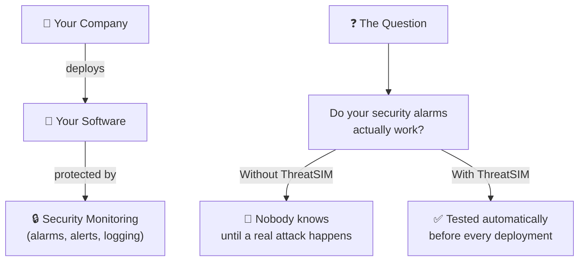
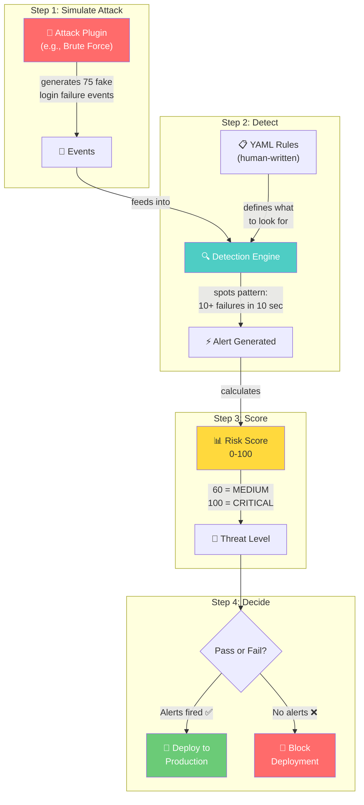
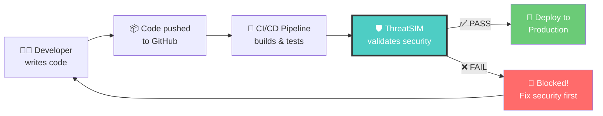

# ThreatSIM — Demo Walkthrough
### *For Non-Technical Audiences (Stakeholders, Interviewers, Team Members)*

---

## 🏠 The Elevator Pitch (30 seconds)

> **"Every building has fire alarms. But how do you know they actually work? You test them."**
>
> ThreatSIM does the same thing — but for **cybersecurity**. It simulates fake attacks against your software, and checks whether your security alarm systems detect them. If they do, your software is safe to deploy. If they don't, something is broken and deployment is blocked.

---

## 🔥 The Problem We Solve

Think of it like this:



### Real-World Analogy

| Scenario | Without ThreatSIM | With ThreatSIM |
|----------|-------------------|----------------|
| 🏢 Fire safety | Hope the fire alarm works when a real fire starts | **Test the fire alarm regularly** with controlled smoke |
| 🏥 Hospital | Hope the heart monitor beeps during cardiac arrest | **Test monitors daily** with simulated signals |
| ✈️ Aviation | Hope radar detects enemy aircraft during war | **Run simulated flights** to verify radar works |
| 💻 **Cybersecurity** | Hope your SIEM catches a real hacker | **Run simulated attacks** to verify detection works |

---

## 🎬 Live Demo Script

### Demo 1: "Show Me All The Attacks We Can Simulate"

**What you say:** *"ThreatSIM comes with 5 built-in attack types that security teams commonly need to defend against."*

**What you run:**
```
./threatsim list
```

**What the audience sees:**
```
  Available Attack Plugins (5)
  ─────────────────────────────────────────────
  Brute Force Login Attack       [brute_force]
    Simulates rapid failed login attempts against a target service

  Port Scanning Attack           [port_scan]
    Simulates network port scanning to discover open services

  DDoS HTTP Burst Attack         [ddos]
    Simulates a high-volume HTTP request burst to overwhelm a service

  Credential Stuffing Attack     [credential_stuffing]
    Simulates automated logins with stolen credential lists

  Privilege Escalation Attack    [privilege_escalation]
    Simulates attempts to gain higher system privileges.
  ─────────────────────────────────────────────
```

**What you explain:**
> *"Each of these is a type of cyber attack that real hackers use. We're not actually attacking anything — we're simulating what the attack looks like so we can check if our alarms would catch it."*

---

### Demo 2: "Watch An Attack Happen In Real-Time" ⭐

**What you say:** *"Let me show you what a brute force attack looks like. This is when a hacker tries thousands of password combinations to break into an account."*

**What you run:**
```
./threatsim simulate brute_force -d 3s -r 5
```

**What the audience sees:**
```
  ⚔  Brute Force Login Attack
  ─────────────────────────────────────
  Plugin:    brute_force
  Target:    10.0.0.1
  Service:   auth-service
  Source IP:  10.1.2.3
  Duration:  3s
  Rate:      5 events/sec
  ─────────────────────────────────────

▶ Simulation started
  [11:16:02.036] login_failed    │ 10.1.2.3 → 10.0.0.1 │ user=user
  [11:16:02.236] login_failed    │ 10.1.2.3 → 10.0.0.1 │ user=deploy
  [11:16:02.436] login_failed    │ 10.1.2.3 → 10.0.0.1 │ user=user
  [11:16:02.636] login_failed    │ 10.1.2.3 → 10.0.0.1 │ user=deploy
  [11:16:02.836] login_failed    │ 10.1.2.3 → 10.0.0.1 │ user=root
  [11:16:03.036] login_failed    │ 10.1.2.3 → 10.0.0.1 │ user=root
  [11:16:03.236] login_failed    │ 10.1.2.3 → 10.0.0.1 │ user=deploy
  [11:16:03.437] login_failed    │ 10.1.2.3 → 10.0.0.1 │ user=deploy
  [11:16:03.636] login_failed    │ 10.1.2.3 → 10.0.0.1 │ user=admin

  ┌──────────────────────────────────────────┐
  │ 🚨 ALERT: MEDIUM                         │
  │                                          │
  │  Suspicious Activity Detected            │
  │  Source IP:       10.1.2.3               │
  │  Risk Score:      60                     │
  │  Rules Tripped:   brute_force_attack     │
  └──────────────────────────────────────────┘

  ─────────────────────────────────────
  ✓ Simulation Complete
  Plugin:     Brute Force Login Attack
  Events:     15 events generated
  Duration:   3s
  Throughput: 5.0 events/sec
  ─────────────────────────────────────
```

**What you explain:**
> *"See how the attack is running — each line is a failed login attempt, 5 per second. After 10 failed attempts, the system raised an 🚨 ALERT — it detected the attack! That's exactly what would happen in a real scenario. The red alert box shows the attacker's IP address and a risk score of 60 out of 100."*

---

### Demo 3: "The Main Feature — Security Validation Gate" ⭐⭐

**What you say:** *"This is the core feature. In one command, we run a fake attack AND check whether our security system caught it. This is what runs automatically before every software deployment."*

**What you run:**
```
./threatsim validate --plugin brute_force --expect-alert
```

**What the audience sees:**
```
  ╔════════════════════════════════════════════╗
  ║   🛡️  ThreatSIM Security Validation Gate   ║
  ╚════════════════════════════════════════════╝

  Attack:       Brute Force Login Attack
  Plugin:       brute_force
  Expect Alert: YES (PASS if detection fires)
  ─────────────────────────────────────────────

  ▶ Running Brute Force Login Attack simulation...
  🔔 Alert fired: 10.1.2.3 → Score: 60, Level: MEDIUM
  🔔 Alert fired: 10.1.2.3 → Score: 100, Level: CRITICAL
  🔔 Alert fired: 10.1.2.3 → Score: 100, Level: CRITICAL
  🔔 Alert fired: 10.1.2.3 → Score: 100, Level: CRITICAL

  ─────────────────────────────────────────────
  ✅ VALIDATION PASSED
  Events:     75 generated
  Alerts:     7 fired
  Rules:      5 loaded
  Duration:   5.2s
  Message:    Detection validated: 7 alert(s) fired from 75 events.
              Your security rules are working.
  ─────────────────────────────────────────────
```

**What you explain:**
> *"See that green ✅ VALIDATION PASSED? That means our security alarm system is working correctly. If it had said ❌ VALIDATION FAILED, it would mean our security is broken and the software deployment would be automatically blocked."*

> *"This ran 75 simulated attack events in 5 seconds. The detection engine caught the attack 7 times, escalating the risk score from 60 up to 100 (CRITICAL). That's exactly what we want."*

---

### Demo 4: "Different Types of Attacks"

**What you say:** *"We don't just test one type of attack. Let me show you port scanning — this is when a hacker scans your network to find vulnerable entry points."*

**What you run:**
```
./threatsim validate --plugin port_scan --expect-alert --duration 3s
```

**What the audience sees:**
```
  ╔════════════════════════════════════════════╗
  ║   🛡️  ThreatSIM Security Validation Gate   ║
  ╚════════════════════════════════════════════╝

  Attack:       Port Scanning Attack
  Plugin:       port_scan
  Expect Alert: YES (PASS if detection fires)
  ─────────────────────────────────────────────

  ▶ Running Port Scanning Attack simulation...
  🔔 Alert fired: 10.1.2.3 → Score: 30, Level: LOW
  🔔 Alert fired: 10.1.2.3 → Score: 60, Level: MEDIUM
  🔔 Alert fired: 10.1.2.3 → Score: 90, Level: CRITICAL

  ─────────────────────────────────────────────
  ✅ VALIDATION PASSED
  Events:     45 generated
  Alerts:     3 fired
  Rules:      5 loaded
  Duration:   3.2s
  Message:    Detection validated: 3 alert(s) fired from 45 events.
              Your security rules are working.
  ─────────────────────────────────────────────
```

**What you explain:**
> *"Notice how the risk score escalated — LOW → MEDIUM → CRITICAL. Each time the system detected more scanning, the threat level went up. The system correctly identified this as a growing threat."*

---

### Demo 5: "What CI/CD Teams See"

**What you say:** *"For automated systems, we output machine-readable JSON so other tools can parse the results."*

**What you run:**
```
./threatsim validate --plugin brute_force --expect-alert --json
```

**What the audience sees:**
```json
{
  "status": "PASS",
  "plugin_id": "brute_force",
  "events_total": 75,
  "alerts_fired": 7,
  "risk_scores": [
    {
      "source_ip": "10.1.2.3",
      "score": 60,
      "threat_level": "MEDIUM"
    },
    {
      "source_ip": "10.1.2.3",
      "score": 100,
      "threat_level": "CRITICAL"
    }
  ],
  "rules_loaded": 5,
  "duration": "5.2s",
  "message": "Detection validated: 7 alert(s) fired from 75 events. Your security rules are working."
}
```

**What you explain:**
> *"This JSON output gets consumed by CI/CD pipelines like GitHub Actions. If the `status` is `PASS`, deployment continues. If it's `FAIL`, deployment is blocked automatically. No human intervention needed."*

---

## 🧩 How The Pieces Fit Together

**For the audience:** *"Let me walk you through what happens inside ThreatSIM when you run a validation."*



---

## 📋 The Detection Rules (Non-Technical View)

**What you say:** *"The detection rules are written in simple YAML — basically plain English. Security teams can modify these without writing any code."*

**Example rule (what you show):**

```yaml
rules:
  - name: brute_force_attack
    description: "Detects rapid brute force login attempts"
    condition:
      event_type: login_failed    # Watch for failed logins
      group_by: source_ip         # Group by attacker's IP
      threshold: 10               # If 10+ failures...
      window: 10s                 # ...within 10 seconds
    severity: HIGH                # This is serious
```

**What you explain:**
> *"This rule says: If we see 10 or more failed login attempts from the same IP address within 10 seconds, raise a HIGH severity alert. Security teams write rules like this — no programming needed."*

---

## 🔄 Where It Fits In Your Workflow



**What you explain:**
> *"ThreatSIM sits right in the deployment pipeline. Every time a developer pushes code, before it goes live, ThreatSIM automatically runs security validation. If it passes, code gets deployed. If it fails, the deployment is blocked and the team gets notified. This happens completely automatically — no manual security reviews needed for every deployment."*

---

## ❓ Anticipated Questions & Answers

### "Is this actually attacking something?"
> **No.** ThreatSIM generates fake security events internally. It's like a fire drill — nobody is in danger, but we're testing if the alarm system works. In "active mode," it can send safe test traffic to staging environments, but never to production.

### "Why not just hire penetration testers?"
> Pen testers are expensive and test once a quarter. ThreatSIM runs **automatically on every code deploy** — hundreds of times per month. Think of it as continuous security testing vs. one-time audits.

### "What happens when it finds a problem?"
> The deployment is automatically blocked. The development team gets a report showing exactly which security rule failed, so they can fix it quickly.

### "How long does a validation take?"
> About **5 seconds**. It runs as part of the normal CI/CD pipeline, adding minimal overhead.

### "Can we add custom attack types?"
> Yes. The plugin architecture makes it easy to add new attack simulations. Each plugin is a self-contained module.

### "What technologies is this built with?"
> Go (backend), with YAML for configurable detection rules. It's designed to be fast, lightweight, and have zero external dependencies for the core validation feature.

---

## 🎯 Key Takeaways For Your Audience

1. **ThreatSIM is a "security smoke test"** — it tests your security alarms by simulating fake attacks
2. **It runs automatically** in your deployment pipeline — no manual work
3. **It's fast** — 5 seconds per validation
4. **It blocks unsafe deployments** — if security detection is broken, code doesn't ship
5. **It's configurable** — security teams write detection rules in plain YAML, no coding needed
6. **It reports results** — JSON output for machines, visual output for humans

---

## 📌 One-Liner For Different Audiences

| Audience | What to say |
|----------|-------------|
| **CEO** | *"It prevents security breaches by automatically testing our defenses before every software release."* |
| **CTO** | *"It's a CI/CD security validation gate — simulates attacks and validates detection rules pass before deployment."* |
| **Interviewer** | *"I built a tool that integrates into CI/CD pipelines to continuously validate security detection systems using simulated attacks."* |
| **Security Team** | *"It's automated purple teaming — runs YAML-defined detection rules against simulated MITRE ATT&CK patterns in the deployment pipeline."* |
| **Non-tech friend** | *"It's like testing a fire alarm by making fake smoke — but for computer security."* |
