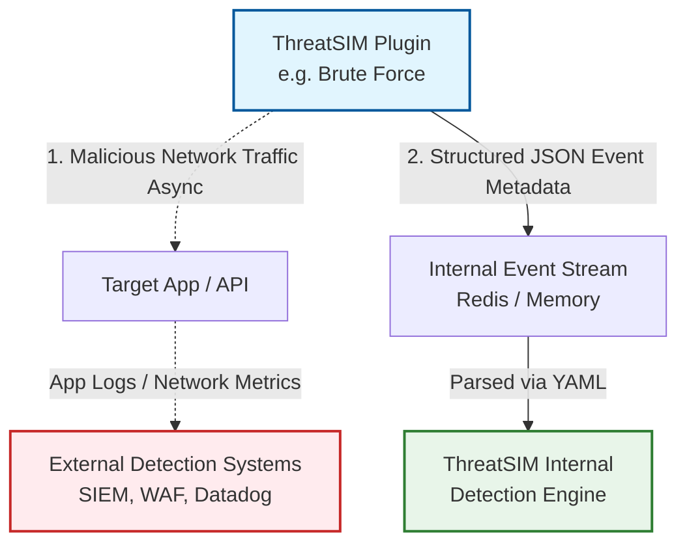

# ThreatSIM: Project Context & Knowledge Base

This document serves as a comprehensive overview of **ThreatSIM**, designed to be fed into LLM prompts or read by agents in new chat sessions to quickly understand the project's purpose, architecture, and current state. It ensures consistent development aligned with the project's core vision.

---

## 1. Project Vision & Purpose

**ThreatSIM** is an open-source cyber attack simulation platform written in Go.
The core problem it solves is the **validation of security monitoring**. Security teams often write detection rules (in SIEMs, IDS/IPS, etc.) but rarely test if they actually trigger in reality.
ThreatSIM acts as a "Security as Code" testing tool, simulating attacks (like brute force or port scans) safely so teams can verify their alerts fire correctly, particularly within a CI/CD pipeline.

## 2. Tech Stack

- **Language Core:** Go (1.24+) for high concurrency, performance, and single-binary distribution.
- **CLI Framework:** `spf13/cobra` for enterprise-grade command-line structuring.
- **Streaming Backend:** Redis Streams (local/dev) or Kafka (production scale), abstracted behind a Go interface. Includes a fallback in-memory stream for simple CLI usage.
- **Future Tech (Planned):** PostgreSQL (state storage), Vite+React (dashboard), Prometheus/Grafana (observability).

## 3. Core Architecture

ThreatSIM behaves like an event pipeline:

1. **Attack Plugins:** Generate specific malicious traffic towards a target AND produce structural metadata about the attack (Events).
2. **Scenario Engine:** Orchestrates multiple attack plugins (e.g., scan -> stuff credentials -> escalate).
3. **Event Streaming:** Safely queues all the simulated attack metadata via Redis/in-memory.
4. **Detection Engine:** Parses the event stream using YAML-defined rules (e.g., `threshold: 20`, `window: 30s`) to detect the simulated attack natively.
5. **Risk Scoring & Alerts:** Assigns risk scores to IPs and triggers notifications (Slack, Webhooks).

## 4. Dual Execution Model (How Testing Works)

When ThreatSIM runs a true end-to-end simulation, it performs **two simultaneous actions** per attack loop:

1. **External Traffic Generation:** It sends actual (but safe) malicious network traffic to the target system (e.g., firing hundreds of HTTP login requests). This tests your _external_ real-world security infrastructure (SIEMs, WAFs, IDS/IPS, Datadog monitoring).
2. **Internal Event Generation:** Simultaneously, the plugin generates structured JSON metadata (`Events`) and pushes them to ThreatSIM's internal stream (Memory/Redis) to test its own _internal_ YAML-based Detection Engine.

> **⚠️ Architectural Constraint & Implementation Flaws to Avoid:**
>
> - **Blocking I/O:** The external network call (e.g., HTTP POST) must **not** block the internal event stream (`sink` execution). Plugins need to execute these actions asynchronously (using goroutines or decoupled channels) to maintain consistent simulated attack rates. If the target server hangs, the internal event telemetry shouldn't crash.
> - **Execution Modes:** Not all users want to hit external networks. Plugins should anticipate configuration flags (e.g., `--dry-run` or `--mode=internal-only`) to skip the network dialler and only generate internal YAML-testing events.
> - **Protocol Specificity:** "Target: 10.0.0.1" isn't enough for real external traffic. A well-designed brute-force plugin must accept specific HTTP/SSH/FTP configurations to generate valid, parsable traffic.

## 5. Key Entities / Concepts

- **Event:** A standardized JSON metadata package generated by a plugin (e.g., `event_type: login_failed`, with `source_ip` and `target`).
- **Plugin Interface:** Every attack is a plugin implementing `ID()`, `Name()`, `Description()`, `DefaultConfig()`, and `Execute(ctx, config, sink)`.
- **Sink:** A callback/channel where plugins push `Event` objects as they execute their simulated attacks.
- **Rule:** A YAML definition evaluated by the Detection Engine to identify malicious event patterns over time windows.

## 6. Software Structure (`/internal` modularity)

- `cmd/threatsim/`: The entry point for the CLI binaries (`main`, `simulate`, `list`).
- `internal/core/`: Contains the foundational domain types (`Event`, `Plugin`, `Rule`, `Scenario`). **Everything relies on this.**
- `internal/plugins/`: Contains the attack implementations (e.g., `brute_force/`, `port_scan/`). Includes a central `registry.go` to load them.
- `internal/streaming/`: Event stream implementations (`memory/`, `redis/`).
- _Future Modules:_ `internal/detection/`, `internal/risk/`, `internal/alerting/`, `internal/api/`.

## 7. Current Development State

The project is being developed in phases.

- **Currently Completed (Phases 1-5):** The core CLI, plugin registry, event streaming interfaces, Detection Engine, Risk Engine, Scenario Engine, Alert System, REST API, WebSocket server, PostgreSQL storage, and the React Dashboard.
- **Future Goals (Phase 6):** Observability (Prometheus/Grafana), Docker/Kubernetes deployments, and CI/CD Pipeline integration.

## 8. Adding New Features (Development Guide)

When prompted to build a new feature, abide by these rules:

1. **Plugins:** Always put new attack logic inside its own folder in `internal/plugins/`. Ensure it implements the `core.Plugin` interface, and register it in `cmd/threatsim/main.go`.
2. **Interfaces over implementations:** Always rely on interfaces defined in `internal/core/` to prevent circular dependencies.
3. **Concurrency:** Attacks should respect `context.Context` for proper cancellation and timeouts.
4. **CLI updates:** When adding new top-level features, configure them as Cobra subcommands in `cmd/threatsim/`.

---

_End of Context Document. Feed this to your AI assistant at the start of a session to guarantee architectural consistency._
