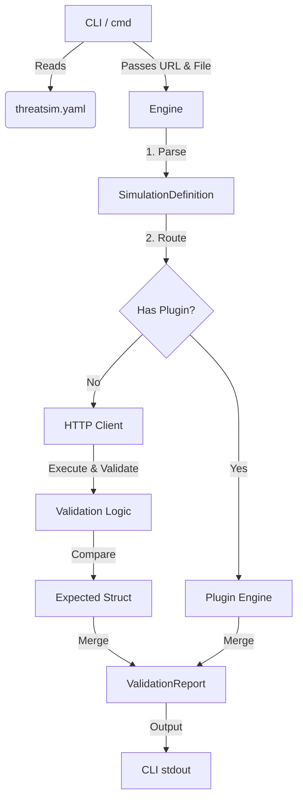

# ThreatSim Internals & Architecture

ThreatSim is engineered with a strict separation of concerns, decoupling the CLI layer from the core execution engine. This ensures the engine is portable, highly testable, and primed for future expansion.

## Project Structure

```text
threatsim/
├── cmd/             # Cobra CLI layer (flag parsing, command routing)
├── pkg/
│   ├── engine/      # Core business logic (loading, expanding, executing, reporting)
│   ├── plugins/     # Extensible security workflow plugins (e.g., bruteforce)
│   │   └── utils/   # Decoupled utility generators
│   └── types/       # Global data models and schemas
├── simulations/     # User-defined YAML/JSON test files
└── threatsim.yaml   # Global workspace configuration
```

## Architecture Overview



## Core Components

### 1. Data Models (`pkg/types/simulation.go`)
The foundation of ThreatSim is its flexible schema:
- **`Simulation`**: Represents a test scenario. It natively supports standard HTTP validations (via `request` and `expected`), or handing execution off to a complex Go module (via `plugin` and `config`).
- **`Request`**: Defines the HTTP method, path, headers, query parameters, and raw string body.
- **`Expected`**: The criteria for success. Validations include `status_code`, exact `headers` matching, `body_contains` substrings, and `body_regex` pattern matching.
- **`Extract`**: Captures tokens, IDs, or variables from successful responses using `JSON` path dot-notation, HTTP `Header` lookups, or `Regex` capture groups. These are stored in the Engine's state.
- **`ValidationReport`**: A rolled-up aggregate of all `SimulationResult` executions.

### 2. Execution Engine (`pkg/engine/engine.go`)
The engine operates entirely independently of `os.Stdout` or CLI contexts, making it an ideal library for external orchestration.

1. **Configuration Loading:** If no CLI flags are supplied, the tool parses a local `threatsim.yaml`.
2. **Parsing:** `LoadSimulation` expands OS environment variables (e.g., `${API_KEY}`) to prevent hardcoding secrets, then unmarshals the YAML/JSON file and ensures structural integrity.
3. **Execution Routing:** The engine loops over the simulation definitions:
   - If a simulation has a `plugin` defined, standard HTTP validation is bypassed, and execution context is handed to the Plugin architecture.
   - Otherwise, standard HTTP round-trips occur using `context.WithTimeout` to prevent hanging.
4. **Interpolation & Extraction**: Before any request is sent, the Engine interpolates `{{state.VAR}}` references. If the request passes validation (reading the response safely via `io.LimitReader`), the Engine parses the response body/headers according to the `Extract` block and stores the variables in memory.
5. **Reporting**: Results are handed to a `Reporter` interface. Any dynamically extracted `{{state}}` variables are automatically masked from the final output (Console, JSON, HTML, or PDF) to prevent credential leakage in CI/CD pipelines.

### 3. Plugin Architecture (`pkg/plugins/`)
The plugin system transforms ThreatSim from a declarative HTTP validation tool into a robust, Turing-complete security suite.
- **The Interface**: Any struct implementing `Name() string`, `Description() string`, and `Execute(simName string, ctx Context, config map[string]interface{}) []types.SimulationResult` can be registered as a plugin.
- **The Registry**: Plugins register themselves globally in their `init()` functions.
- **Capabilities**: Because plugins are native Go code, they can implement highly complex, stateful workflows. 
  - **`bruteforce`**: Takes a username and `num_requests`, generates a dictionary using a decoupled utility, and safely iterates against the target endpoint while strictly enforcing safety guardrails (aborting if limits are exceeded to prevent accidental DoS). It returns unique validation results for each attempt (marking a `200 OK` as an unexpected security behavior).

## Design Philosophy
- **Test-Driven Foundation:** The core Engine logic, state interpolation, deep JSON extraction, and end-to-end execution flow are rigorously validated by an internal `httptest.NewServer` mock suite in `engine_test.go`.
- **Go (Golang):** Chosen for its concurrency support, robust `net/http` standard library, and ease of distributing cross-platform, single-binary CLI tools.
- **Minimal Dependencies:** By relying almost exclusively on the Go standard library (with the exception of `yaml.v3` and `cobra`), ThreatSim remains incredibly lightweight, secure, and easy to maintain.
- **Extensibility First:** The validation logic checks against an `Expected` struct rather than hardcoded rules, making it trivial to add features like `RegexMatch` or `MaxLatency` in the future.
